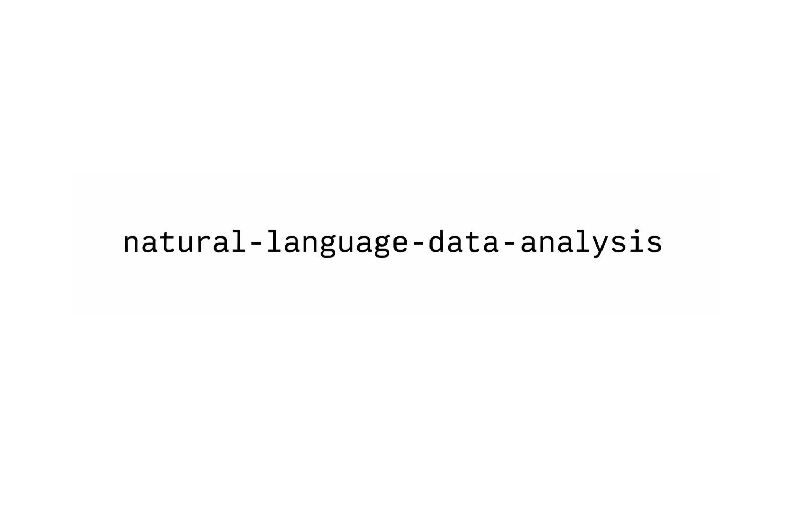

# natural-language-data-analysis

A project that enables users to interact with structured datasets using natural language queries. The system interprets user questions and translates them into data analysis operations, returning insights in a human-readable format.

## Objective

The goal of this project is to simulate a simplified version of modern AI-driven analytics tools, allowing non-technical users to extract insights from data without writing code.

## Core Features

- Natural language query interface
- Data cleaning and preprocessing pipeline
- Exploratory Data Analysis (EDA)
- Query-to-function mapping (rule-based and AI-assisted)
- Automated insights generation
- Optional visualization support

## Tech Stack

- Python
- Pandas
- JupyterLab
- Streamlit (planned)
- LLM integration (planned)
  - Groq API / local models (Ollama)

## Project Structure
natural-language-data-analysis/
│
├── data/                # Raw and processed datasets
├── notebooks/           # Jupyter notebooks (EDA and experiments)
├── src/                 # Core logic
│   ├── data_processing.py
│   ├── analysis.py
│   ├── query_handler.py
│   └── utils.py
│
├── app/                 # Interface (Streamlit - planned)
│   └── app.py
│
├── tests/               # Unit tests (planned)
├── requirements.txt
└── README.md

## How It Works

1. User inputs a question in natural language
2. The system interprets the query
3. Maps it to a predefined function or generates logic via LLM
4. Executes the analysis using Pandas
5. Returns the result as text (and optionally charts)

## Example Queries

- "What is the best-selling product?"
- "How have sales changed over time?"
- "Which category generates the most revenue?"
- "Is there a correlation between price and sales?"

## Development Roadmap

### Phase 1: Data Handling and EDA
- [ ] Select and import dataset
- [ ] Perform data cleaning
- [ ] Conduct exploratory data analysis
- [ ] Define key metrics

### Phase 2: Rule-Based Query System
- [ ] Implement basic query parsing
- [ ] Map common questions to functions
- [ ] Return structured responses

### Phase 3: AI Integration
- [ ] Integrate LLM (Groq or local via Ollama)
- [ ] Enable dynamic query interpretation
- [ ] Improve response generation

### Phase 4: Interface Development
- [ ] Build UI with Streamlit
- [ ] Add input field for queries
- [ ] Display results and visualizations

### Phase 5: Improvements
- [ ] Add data visualization (charts)
- [ ] Implement logging and error handling
- [ ] Optimize performance
- [ ] Add support for multiple datasets

## Future Enhancements

- SQL database integration
- User authentication
- Dashboard generation
- Predictive analytics (machine learning models)
- API deployment

## Installation

```bash
git clone https://github.com/your-username/natural-language-data-analysis.git
cd natural-language-data-analysis
pip install -r requirements.txt
```

## Usage

Run JupyterLab for development:
```bash
jupyter lab
```
Future(planned):
```bash
streamlit run app/app.py
```

## Contribution

This is a personal portfolio project, but suggestions are welcome.

## License

MIT License
